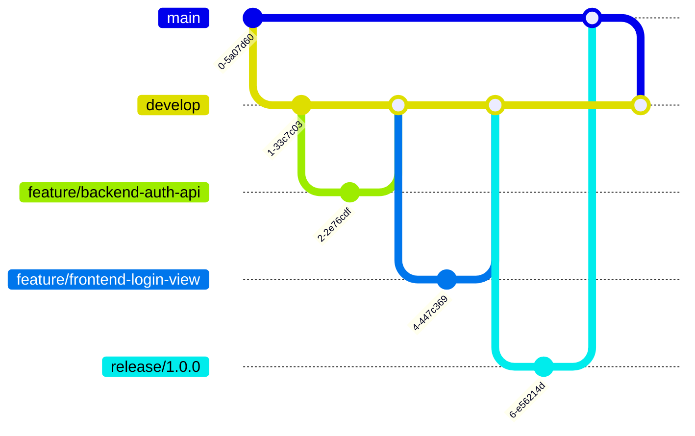

# 开发工作流

本文档为「家庭照片管理系统」项目定义了一套标准的开发工作流。

**作者**: 汪玮芸
**创建日期**: 2025-06-25
**最后更新**: 2025-07-06
**文档状态**: 活跃
**文档版本**: 完整版

## 1. 核心原则

1.  **文档驱动 (Documentation-Driven)**: 所有开发活动都必须以 `docs/` 目录下的权威文档为依据。代码的实现必须与所有设计和流程文档（`PRD.md`, `API.md`, `ARCHITECTURE.md`, `WORKFLOW.md` 等）保持一致。任何功能或变更，都应先有文档定义。

2.  **前后端分离 (Frontend/Backend Separation)**: 深刻理解并严格执行前后端分离的开发模式。所有任务都必须明确是在 `backend/` 还是 `frontend/` 目录中执行。

3.  **小步迭代 (Incremental Development)**: 将复杂任务分解为多个简单、明确的子任务，快速验证并集成。

4.  **测试驱动 (Test-Driven)**: 鼓励采用测试驱动开发（TDD）模式。在编写功能代码前，先编写测试用例，确保代码的正确性和可维护性。

5.  **代码即文档 (Code as Documentation)**: 编写清晰、自解释的代码，遵循统一的编码规范，减少额外文档的维护成本。

6.  **完成仪式 (Definition of Done)**: 任何任务在被最终标记为完成之前，必须逐一确认并完成一系列检查清单，确保质量和文档同步。

7.  **关联性检查 (Dependency-Check after Refactoring)**: 在完成任何大规模的调试或代码重构后，严禁立刻提交。必须重新、完整地检查所有被修改的文件及其直接依赖项，确保所有内部引用（如模型关系、函数调用、API契约等）都保持一致。必须假设"修复一处，可能破坏另一处"。

## 2. 核心项目上下文

在执行任何任务之前，必须充分理解以下核心项目规范。

### 2.1 系统高级架构

系统采用 **前后端分离** 的现代化架构设计。

-   **后端 (`backend/`)**: 基于 **Flask** 的 **RESTful API** 服务器，负责业务逻辑、数据处理和持久化。
-   **前端 (`frontend/`)**: 基于 **Vue.js** 的 **单页应用 (SPA)**，负责用户界面和交互体验。
-   **通信**: 前后端通过 **RESTful API** 进行通信，使用 **JSON** 作为数据交换格式，并采用 **JWT** 进行无状态认证。

详细架构请参考 **`docs/design/ARCHITECTURE.md`** (该文档已根据最新架构重写)。

### 2.2 技术选型

-   **后端**: Python + Flask (模块化架构) + SQLAlchemy + Pytest
-   **前端**: Vue.js 3 + Vite + Pinia + Vue Router + Element Plus + Axios
-   **数据库**: SQLite
-   **部署**: 分别部署后端API服务和前端静态文件。

详细技术规范请参考 `docs/design/TRD.md`。

### 2.3 文档体系 (Single Source of Truth)

| 文档路径 | 描述 |
| :--- | :--- |
| `docs/design/PRD.md` | **产品需求**：用户故事、功能列表、验收标准。 |
| `docs/design/ARCHITECTURE.md`| **系统架构**：前后端分离架构图、数据流。 |
| `docs/design/TRD.md` | **技术选型**：明确的前后端技术栈。 |
| `docs/design/API.md` | **API接口**：RESTful端点、请求/响应格式、JWT认证。 |
| `docs/design/ERD.md` | **数据模型**：数据库表结构和关系。 |
| `docs/design/UI.md` | **UI设计**：基于组件的设计理念，使用Element Plus。 |
| `docs/process/WORKFLOW.md` | **开发流程**：Git工作流、任务执行步骤。 |
| `docs/process/TODOLIST.md` | **任务清单**：所有待开发的任务列表。 |
| `docs/process/DIR-Structure.md`| **目录结构**：`backend/` 和 `frontend/` 的详细结构。 |
| `docs/process/LOGS.md` | **开发日志 (Active)**：记录项目关键决策和开发进展。 |
| `docs/process/prompt.md` | **AI助手指令**：定义AI助手的行为准则。 |

## 3. 开发流程 (Development Workflow)

项目采用**严格的测试驱动开发 (TDD)**模式，结合简化的Git Flow。所有开发活动必须以测试为先导，以文档为依据。

### 3.1 TDD核心循环

开发中的每一个功能点都必须遵循"红-绿-重构"的循环：
1.  **红 (Red)**: 首先，根据`PRD.md`和`API.md`中的规格，编写一个**失败的测试**。这个测试定义了功能的最终目标。
2.  **绿 (Green)**: 编写最精简、最直接的**系统代码**，仅仅为了让这个测试通过。
3.  **重构 (Refactor)**: 在测试保持通过的前提下，优化和清理刚刚编写的系统代码，使其更清晰、更高效。

### 3.2 Git分支模型

项目采用简化的Git Flow工作流。



-   **`main`**: 生产环境代码。
-   **`develop`**: 主开发分支，所有功能分支从这里创建并合并回来。
-   **`feature/*`**: 功能开发分支，命名规则: `feature/<scope>/<description>` (e.g., `feature/backend/add-photo-upload`)。
-   **`bugfix/*`, `release/*`, `hotfix/*`**: 用于修复、发布和紧急修复。

### 3.3 提交规范

所有代码提交必须遵循**约定式提交 (Conventional Commits)**。

`test(backend-auth): write failing test for user registration`
`feat(backend-auth): implement user registration to pass test`
`refactor(backend-auth): clean up user service logic`

### 3.4 任务执行流程

```mermaid
graph TD
    A[从 TODOLIST.md 认领任务] --> B{阅读相关设计文档<br/>(PRD, API, ERD...)}
    B --> C[创建 feature/* 分支]
    C --> D[编写单元/集成测试<br/>(test_*.py)]
    D --> E{运行测试，确认失败<br/>(Red-红灯)}
    E -- 是 --> F[编写最少的系统代码<br/>(models, services, routes)]
    F --> G{运行测试，直至通过<br/>(Green-绿灯)}
    G -- 是 --> H[重构系统代码<br/>(Refactor)]
    H --> I{所有测试持续通过?}
    I -- 是 --> J[本地试运行系统<br/>进行手动功能测试]
    J --> K{功能符合文档要求?}
    K -- 是 --> L[提交代码 (Conventional Commit)]
    L --> M[创建 Pull Request 到 develop 分支]
    M --> N[代码审查]
    N --> O{审查通过?}
    O -- 是 --> P[合并PR]
    P --> Q[更新 TODOLIST.md 任务状态]
    Q --> R[更新 LOGS.md 开发日志]
    R --> S[任务完成]
    E -- 否 --> D
    G -- 否 --> F
    I -- 否 --> H
    K -- 否 --> F
    O -- 否 --> F
```

## 4. 开发规范

### 4.1 后端 (Backend - Flask)

-   **目录**: 所有后端代码必须在 `backend/` 目录下。
-   **分层**:
    -   `home_photo/models/`: 定义 `SQLAlchemy` 模型。
    -   `home_photo/services/`: 实现纯业务逻辑。
    -   `home_photo/routes/`: 定义 Flask `Blueprint`，处理HTTP请求和响应。
-   **命名**: 遵循 `PEP 8` (e.g., `snake_case` for functions/variables, `UpperCamelCase` for classes)。

### 4.2 前端 (Frontend - Vue)

-   **目录**: 所有前端代码必须在 `frontend/` 目录下。
-   **分层**:
    -   `src/services/`: 封装 `Axios` API调用。
    -   `src/store/`: 使用 `Pinia` 管理全局状态。
    -   `src/views/`: 页面级组件。
    -   `src/components/`: 可复用的UI组件 (基于 Element Plus)。
-   **命名**: `PascalCase` for components, `camelCase` for functions/variables.

## 5. 任务完成检查清单 (Definition of Done)

每个任务完成前，必须检查以下项目：

-   [ ] 代码实现与设计文档一致。
-   [ ] 所有为新功能编写的单元测试和集成测试已通过。
-   [ ] 所有功能测试 (如使用Curl手动测试API端点) 已通过。
-   [ ] **最终检查：运行了完整的、全局的测试套件，确保没有引入任何回归错误。**
-   [ ] 系统已在本地成功试运行。
-   [ ] 功能经过本地端到端联调测试，符合 `PRD.md` 和 `API.md` 的要求。
-   [ ] 代码符合项目编码规范。
-   [ ] 没有硬编码的敏感信息。
-   [ ] Pull Request 已被至少一名团队成员审查并批准。
-   [ ] 分支已成功合并到 `develop`。
-   [ ] `docs/process/TODOLIST.md` 中对应任务的状态已更新。
-   [ ] `docs/process/LOGS.md` 中已添加本次任务的开发日志。
-   [ ] **(关键原则)** 该功能模块的代码已被视为稳定，如无必要不应再修改。

---
最后更新: 2025-07-08 | 版本: V1.2 