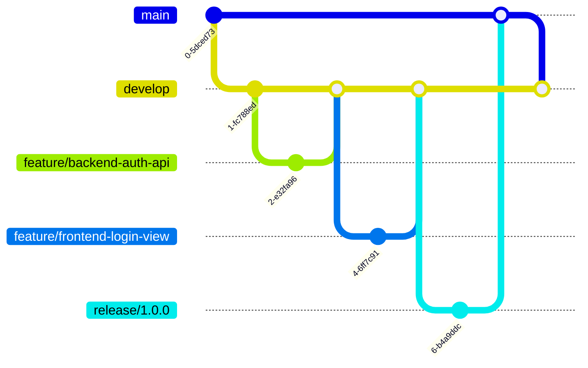

# 开发工作流 (V3.0 AI协同版)

本文档为「家庭照片管理系统」项目定义了一套标准的、**AI协同的、三驱动**开发工作流。

**作者**: 汪玮芸
**创建日期**: 2025-06-25
**最后更新**: 2025-07-12
**文档状态**: 活跃
**文档版本**: **V3.0 (AI协同版)**

## 1. 核心驱动原则 (不可动摇)

项目由三大核心原则驱动，所有开发活动必须严格遵守。

1.  **文档驱动 (Documentation-Driven)**: `docs/` 目录是项目中唯一的真理之源。所有开发活动必须以权威的静态设计文档为依据。

2.  **任务驱动 (Task-Driven)**: 开发过程被分解为`docs/process/TODOLIST.md`中一系列明确的任务。每个任务都是一个独立的、可验证的工作单元。

3.  **测试驱动 (Test-Driven)**: 采用严格的测试驱动开发（TDD）模式。**任何系统代码的编写都必须由一个事先存在的、失败的测试来驱动。**

## 2. 二元对参照与偏差零容忍原则 (不可动摇)

为了确保开发过程不偏离预设轨道，我们建立了一套"**计划 vs 现实**"的二元对参照体系。

| 计划 (静态权威文档) | 现实 (动态过程记录) | 作用 |
| :--- | :--- | :--- |
| `docs/process/TODOLIST.md` | `docs/process/LOGS.md` | 任务计划 vs 任务现实 |
| `docs/process/plan-DIR.md` | `docs/process/work_directory.md` | 架构蓝图 vs 代码现实 |

**核心戒律：偏差零容忍 (Zero Tolerance for Deviation)**
- **一旦"现实"与"计划"出现任何未在`LOGS.md`中明确记录的、非预期的偏差，必须立即停止所有新的功能开发。**
- **此时，最高优先级的任务是"消除偏差"，直到现实重新与计划对齐。**
- **严禁带着技术债务前进，这是避免重蹈覆辙的根本保证。**

## 3. AI协同原则 (新增)

为将AI助手的强大能力整合到我们严格的开发流程中，特定义以下协同原则：

1.  **层级关系**: `WORKFLOW.md` 是**宏观战略**，是所有开发者（包括AI）必须遵守的最高准则。`RIPER-5`协议是AI执行具体任务时的**微观战术**，其所有操作都必须服务于本工作流的目标。
2.  **AI角色**: AI助手在开发流程中扮演一个**可控的、透明的、遵循协议的执行者**。其主要职责是在开发环节（特别是编码和测试阶段）高效、可靠地完成任务。
3.  **最终裁决权**: 开发者拥有对AI所有产出的**最终审查和裁决权**。AI的任何代码变更，在通过`RIPER-5`协议中的交互式审查后，仍需经过标准的`Pull Request`和人工代码审查流程。
4.  **任务闭环提醒 (Task Closure Reminder)**: 在每个任务的所有编码、测试和文档更新工作完成后，AI有责任主动提醒并协助开发者完成必要的Git操作（如创建Pull Request、合并分支），以确保工作流的完整闭环。

## 4. 文档体系 (Single Source of Truth)

项目的所有开发活动必须严格遵照以下文档体系。每个文档有其明确的职责和权威范围，必须在相应的任务中作为主要参考。

| 文档路径 | 描述 | 主要使用者 | 权威范围 |
| :--- | :--- | :--- | :--- |
| `docs/design/PRD.md` | **产品需求文档**：定义用户故事、功能列表、验收标准。是功能正确性的最终裁判。 | 所有开发者 | 功能需求、验收标准 |
| `docs/design/API.md`| **API接口文档**：定义所有RESTful端点、请求/响应格式、状态码和认证机制。前后端接口的唯一约定。 | 前端、后端开发者 | API契约、数据交换格式 |
| `docs/design/ARCHITECTURE.md`| **系统架构文档**：定义前后端分离架构图、数据流和模块职责。系统设计的宏观蓝图。 | 所有开发者 | 系统结构、模块划分 |
| `docs/design/ERD.md` | **数据模型文档**：定义数据库表结构、字段类型和表间关系。后端数据模型的唯一依据。 | 主要是后端开发者 | 数据库设计、ORM模型 |
| `docs/design/TRD.md` | **技术需求文档**：定义前后端技术栈、依赖版本和开发规范。技术选型的唯一依据。 | 所有开发者 | 技术栈、依赖管理 |
| `docs/design/UI.md` | **UI设计文档**：定义页面布局、组件设计和交互流程。前端视觉实现的唯一依据。 | 主要是前端开发者 | 界面设计、交互设计 |
| `docs/process/WORKFLOW.md` | **开发工作流**：定义Git工作流、任务执行步骤和开发规范。所有开发活动的行动指南。 | 所有开发者 | 开发流程、规范 |
| `docs/process/TODOLIST.md` | **任务清单**：所有待开发的任务列表及其状态。任务分配和进度跟踪的唯一依据。 | 所有开发者 | 任务管理、进度跟踪 |
| `docs/process/LOGS.md` | **开发日志**：记录项目关键决策和开发进展。开发历史的唯一官方记录。 | 所有开发者 | 开发历史、决策记录 |
| `docs/process/plan-DIR.md` | **目录结构规划**：定义`backend/`和`frontend/`的详细目录结构。文件组织的唯一依据。 | 所有开发者 | 文件组织、目录规范 |

**设计文档使用优先级**：
1. 在执行任何任务前，必须首先查阅`TODOLIST.md`确认任务详情。
2. 然后，根据任务性质查阅相应的核心设计文档：
   - 后端API开发：必须同时参考`API.md`和`ERD.md`
   - 前端界面开发：必须同时参考`UI.md`和`API.md`
   - 数据库相关任务：必须以`ERD.md`为主要依据
   - 跨层开发：必须以`ARCHITECTURE.md`为高层指导

## 5. 开发流程 (Development Workflow)

项目采用**严格的测试驱动开发 (TDD)**模式，结合简化的Git Flow，并深度集成AI协同。所有开发活动必须以测试为先导，以文档为依据。

### 5.1 TDD核心循环：红-绿-重构 (由AI辅助执行)

开发中的每一个功能点都必须遵循"红-绿-重构"的循环，该循环现在由AI在`RIPER-5`协议的指导下辅助完成。

1.  **红 (Red)**: AI根据`PRD.md`和`API.md`中的规格，通过`RIPER-5`的`PLAN`和`EXECUTE`模式，编写一个**失败的测试**，并提交给开发者审查。
2.  **绿 (Green)**: 在开发者确认测试用例后，AI编写最精简、最直接的**系统代码**，仅仅为了让这个测试通过，并再次提交审查。
3.  **重构 (Refactor)**: 在测试保持通过的前提下，AI对刚刚编写的系统代码进行优化和清理，并提交最终版本供审查。

**关键原则：测试的不可变性**
- 一旦一个测试用例根据需求文档编写完成并通过，它就应该被视为"不可变"的。
- 只有在需求变更时，才能修改测试代码。严禁为了让有问题的系统代码通过而反向修改测试。

### 5.2 Git分支模型

项目采用简化的Git Flow工作流。



-   **`main`**: 生产环境代码。
-   **`develop`**: 主开发分支，所有功能分支从这里创建并合并回来。
-   **`feature/*`**: 功能开发分支，命名规则: `feature/<scope>/<description>` (e.g., `feature/backend/add-photo-upload`)。
-   **`bugfix/*`, `release/*`, `hotfix/*`**: 用于修复、发布和紧急修复。

### 5.3 提交规范

所有代码提交必须遵循**约定式提交 (Conventional Commits)**，清晰地反映TDD步骤。

`test(backend-auth): write failing test for user registration`
`feat(backend-auth): implement user registration to pass test`
`refactor(backend-auth): clean up user service logic`

### 5.4 任务执行流程图 (AI协同版)

```mermaid
graph TD
    A[从 TODOLIST.md 认领任务<br/>(分配给开发者或AI)] --> B{阅读相关设计文档<br/>(PRD, API, ERD...)}
    B --> C[创建 feature/* 分支]
    
    subgraph AI协同开发阶段 (遵循RIPER-5协议)
        D[AI-PLAN: 制定测试计划 (Red)]
        D --> D_EXEC{AI-EXECUTE: 编写失败的测试<br/>(review:true)}
        D_EXEC --> D_REVIEW{用户审查测试代码}
        D_REVIEW -- 批准 --> E[AI-PLAN: 制定实现计划 (Green)]
        E --> E_EXEC{AI-EXECUTE: 编写通过测试的代码<br/>(review:true)}
        E_EXEC --> E_REVIEW{用户审查实现代码}
        E_REVIEW -- 批准 --> F{需要重构?}
        F -- 是 --> G[AI-PLAN/EXEC: 重构代码<br/>(review:true)]
        F -- 否 --> H[开发完成]
        G --> H
    end

    C --> D
    H --> I[提交代码 (Conventional Commit)]
    I --> J[创建 Pull Request 到 develop 分支]
    J --> K[人工代码审查]
    K --> L{审查通过?}
    L -- 是 --> M[合并PR]
    M --> N[更新**过程文档**<br/>(LOGS.md, work_directory.md)]
    N --> O[更新**计划文档**<br/>(TODOLIST.md)]
    O --> P[任务完成]
    
    D_REVIEW -- 修改 --> D
    E_REVIEW -- 修改 --> E
    L -- 否 --> D
```

## 6. 开发规范

### 6.1 后端 (Backend - Flask)

-   **目录**: 所有后端代码必须在 `backend/` 目录下，并与`plan-DIR.md`保持一致。
-   **分层**:
    -   `home_photo/models/`: 定义 `SQLAlchemy` 模型。
    -   `home_photo/services/`: 实现纯业务逻辑。
    -   `home_photo/routes/`: 定义 Flask `Blueprint`，处理HTTP请求和响应。
-   **命名**: 遵循 `PEP 8`。

### 6.2 前端 (Frontend - Vue)

-   **目录**: 所有前端代码必须在 `frontend/` 目录下。
-   **分层**:
    -   `src/services/`: 封装 `Axios` API调用。
    -   `src/store/`: 使用 `Pinia` 管理全局状态。
    -   `src/views/`: 页面级组件。
    -   `src/components/`: 可复用的UI组件。
-   **命名**: `PascalCase` for components, `camelCase` for functions/variables.

### 6.3 开发环境与语言 (新增)

为确保协作的一致性，特规定以下环境与语言规范：

-   **操作系统**: 所有开发活动均在 `Windows 10` 环境下进行。
-   **开发工具**: 使用 `Cursor`作为主要的集成开发环境（IDE）。
-   **命令行工具**: 使用 `PowerShell` 作为标准的命令行接口。
-   **核心技术栈**: 项目后端主要依赖 `Python` 语言生态。
-   **协作语言**:
    -   **AI对用户**: AI助手对开发者的所有文字回应，必须使用**中文**。
    -   **AI内部思考**: AI助手在生成回应前的内部思考过程（例如 `RIPER-5` 协议中的 `[MODE: RESEARCH]` 等部分的内心独白）可以使用**英文**，以保证思维的精确性。

## 7. 任务完成检查清单 (Definition of Done) - **最终裁决**

**警告：此清单是任务的最终"看门人"(Gatekeeper)。任何一项未满足，任务都不能被视为完成，严禁进入下一环节。AI助手在每次任务结束时，必须逐项对照本清单进行自我审查和报告。**

每个任务在提交 `Pull Request` 前，必须由 **执行者(无论是开发者还是AI)** 严格自检以下所有项目：

-   [ ] **1. 计划/现实一致性**: `LOGS.md` 和 `work_directory.md` 的记录是否与 `TODOLIST.md` 和 `plan-DIR.md` 的要求 **完全匹配**？
-   [ ] **2. TODOLIST验收标准**: 代码实现是否 **严格满足** `TODOLIST.md` 中为当前任务定义的 **每一条** "验证标准"？
-   [ ] **3. 设计文档一致性**: 代码实现是否与核心设计文档 (`PRD.md`, `API.md`, `ERD.md` 等) **完全一致**？
-   [ ] **4. 新功能测试通过**: 所有为新功能编写的单元测试和集成测试是否 **全部通过**？
-   [ ] **5. 最终回归测试 (强制命令)**: 是否已经运行了 **完整的、全局的测试套件**，并确认没有引入 **任何** 回归错误？此项为硬性要求，**不可跳过，不可存在侥幸心理**。
-   [ ] **6. 本地端到端联调 (如适用)**: 功能是否经过本地端到端联调测试，并符合 `PRD.md` 和 `API.md` 的要求？
-   [ ] **7. 代码规范**: 代码是否完全符合项目编码规范？
-   [ ] **8. 文档更新**: `TODOLIST.md` 和 `LOGS.md` 是否都已根据本次任务的最终结果 **正确更新**？

**PR创建后的检查项 (由开发者负责)**:

-   [ ] **9. Pull Request审查**: Pull Request 是否已被审查并批准？
-   [ ] **10. 分支合并**: 分支是否已成功合并到 `develop`？

---
最后更新: 2025-07-12 | 版本: V3.0 (AI协同版) 