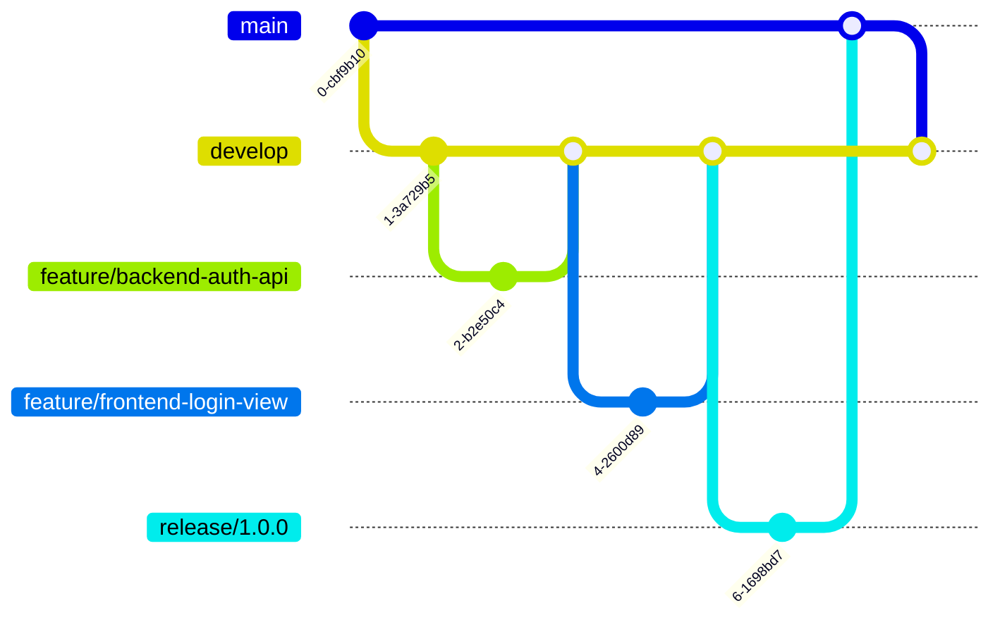

# 开发工作流

本文档为「家庭照片管理系统」项目定义了一套标准的、**三驱动**的开发工作流。

**作者**: 汪玮芸
**创建日期**: 2025-06-25
**最后更新**: 2025-07-08
**文档状态**: 活跃
**文档版本**: **V2.0 (三驱动版)**

## 1. 核心驱动原则

项目由三大核心原则驱动，所有开发活动必须严格遵守。

1.  **文档驱动 (Documentation-Driven)**: `docs/` 目录是项目中唯一的真理之源。所有开发活动必须以权威的静态设计文档为依据。

2.  **任务驱动 (Task-Driven)**: 开发过程被分解为`docs/process/TODOLIST.md`中一系列明确的任务。每个任务都是一个独立的、可验证的工作单元。

3.  **测试驱动 (Test-Driven)**: 采用严格的测试驱动开发（TDD）模式。**任何系统代码的编写都必须由一个事先存在的、失败的测试来驱动。**

## 2. 二元对参照与偏差零容忍原则

为了确保开发过程不偏离预设轨道，我们建立了一套"**计划 vs 现实**"的二元对参照体系。

| 计划 (静态权威文档) | 现实 (动态过程记录) | 作用 |
| :--- | :--- | :--- |
| `docs/process/TODOLIST.md` | `docs/process/LOGS.md` | 任务计划 vs 任务现实 |
| `docs/process/plan-DIR.md` | `docs/process/work_directory.md` | 架构蓝图 vs 代码现实 |

**核心戒律：偏差零容忍 (Zero Tolerance for Deviation)**
- **一旦"现实"与"计划"出现任何未在`LOGS.md`中明确记录的、非预期的偏差，必须立即停止所有新的功能开发。**
- **此时，最高优先级的任务是"消除偏差"，直到现实重新与计划对齐。**
- **严禁带着技术债务前进，这是避免重蹈覆辙的根本保证。**

## 2.3 文档体系 (Single Source of Truth)

项目的所有开发活动必须严格遵照以下文档体系。每个文档有其明确的职责和权威范围，必须在相应的任务中作为主要参考。

| 文档路径 | 描述 | 主要使用者 | 权威范围 |
| :--- | :--- | :--- | :--- |
| `docs/design/PRD.md` | **产品需求文档**：定义用户故事、功能列表、验收标准。是功能正确性的最终裁判。 | 所有开发者 | 功能需求、验收标准 |
| `docs/design/API.md`| **API接口文档**：定义所有RESTful端点、请求/响应格式、状态码和认证机制。前后端接口的唯一约定。 | 前端、后端开发者 | API契约、数据交换格式 |
| `docs/design/ARCHITECTURE.md`| **系统架构文档**：定义前后端分离架构图、数据流和模块职责。系统设计的宏观蓝图。 | 所有开发者 | 系统结构、模块划分 |
| `docs/design/ERD.md` | **数据模型文档**：定义数据库表结构、字段类型和表间关系。后端数据模型的唯一依据。 | 主要是后端开发者 | 数据库设计、ORM模型 |
| `docs/design/TRD.md` | **技术需求文档**：定义前后端技术栈、依赖版本和开发规范。技术选型的唯一依据。 | 所有开发者 | 技术栈、依赖管理 |
| `docs/design/UI.md` | **UI设计文档**：定义页面布局、组件设计和交互流程。前端视觉实现的唯一依据。 | 主要是前端开发者 | 界面设计、交互设计 |
| `docs/process/WORKFLOW.md` | **开发工作流**：定义Git工作流、任务执行步骤和开发规范。所有开发活动的行动指南。 | 所有开发者 | 开发流程、规范 |
| `docs/process/TODOLIST.md` | **任务清单**：所有待开发的任务列表及其状态。任务分配和进度跟踪的唯一依据。 | 所有开发者 | 任务管理、进度跟踪 |
| `docs/process/LOGS.md` | **开发日志**：记录项目关键决策和开发进展。开发历史的唯一官方记录。 | 所有开发者 | 开发历史、决策记录 |
| `docs/process/plan-DIR.md` | **目录结构规划**：定义`backend/`和`frontend/`的详细目录结构。文件组织的唯一依据。 | 所有开发者 | 文件组织、目录规范 |
| `docs/process/prompt.md` | **AI助手指令**：定义AI助手的行为准则和操作模板。AI辅助开发的唯一指南。 | AI助手、开发者 | AI行为准则 |

**设计文档使用优先级**：
1. 在执行任何任务前，必须首先查阅`TODOLIST.md`确认任务详情。
2. 然后，根据任务性质查阅相应的核心设计文档：
   - 后端API开发：必须同时参考`API.md`和`ERD.md`
   - 前端界面开发：必须同时参考`UI.md`和`API.md`
   - 数据库相关任务：必须以`ERD.md`为主要依据
   - 跨层开发：必须以`ARCHITECTURE.md`为高层指导

## 3. 开发流程 (Development Workflow)

项目采用**严格的测试驱动开发 (TDD)**模式，结合简化的Git Flow。所有开发活动必须以测试为先导，以文档为依据。

### 3.1 TDD核心循环：红-绿-重构

开发中的每一个功能点都必须遵循"红-绿-重构"的循环：
1.  **红 (Red)**: 首先，根据`PRD.md`和`API.md`中的规格，编写一个**失败的测试**。这个测试定义了功能的最终目标。
2.  **绿 (Green)**: 编写最精简、最直接的**系统代码**，仅仅为了让这个测试通过。此时不追求代码完美。
3.  **重构 (Refactor)**: 在测试保持通过的前提下，优化和清理刚刚编写的系统代码，使其更清晰、更高效。

**关键原则：测试的不可变性**
- 一旦一个测试用例根据需求文档编写完成并通过，它就应该被视为"不可变"的。
- 只有在需求变更时，才能修改测试代码。严禁为了让有问题的系统代码通过而反向修改测试。

### 3.2 Git分支模型

项目采用简化的Git Flow工作流。



-   **`main`**: 生产环境代码。
-   **`develop`**: 主开发分支，所有功能分支从这里创建并合并回来。
-   **`feature/*`**: 功能开发分支，命名规则: `feature/<scope>/<description>` (e.g., `feature/backend/add-photo-upload`)。
-   **`bugfix/*`, `release/*`, `hotfix/*`**: 用于修复、发布和紧急修复。

### 3.3 提交规范

所有代码提交必须遵循**约定式提交 (Conventional Commits)**，清晰地反映TDD步骤。

`test(backend-auth): write failing test for user registration`
`feat(backend-auth): implement user registration to pass test`
`refactor(backend-auth): clean up user service logic`

### 3.4 任务执行流程图

```mermaid
graph TD
    A[从 TODOLIST.md 认领任务] --> B{阅读相关设计文档<br/>(PRD, API, ERD...)}
    B --> C[创建 feature/* 分支]
    C --> D[**红**<br/>编写失败的单元/集成测试]
    D --> E{运行测试，确认失败}
    E -- 是 --> F[**绿**<br/>编写最少的系统代码以通过测试]
    F --> G{运行测试，直至通过}
    G -- 是 --> H[**重构**<br/>优化系统代码]
    H --> I{所有测试持续通过?}
    I -- 是 --> J[本地试运行系统<br/>进行手动功能测试]
    J --> K{功能符合文档要求?}
    K -- 是 --> L[提交代码 (Conventional Commit)]
    L --> M[创建 Pull Request 到 develop 分支]
    M --> N[代码审查]
    N --> O{审查通过?}
    O -- 是 --> P[合并PR]
    P --> Q[更新**过程文档**<br/>(LOGS.md, work_directory.md)]
    Q --> R[更新**计划文档**<br/>(TODOLIST.md)]
    R --> S[任务完成]
    E -- 否 --> D
    G -- 否 --> F
    I -- 否 --> H
    K -- 否 --> F
    O -- 否 --> F
```

## 4. 开发规范

### 4.1 后端 (Backend - Flask)

-   **目录**: 所有后端代码必须在 `backend/` 目录下，并与`plan-DIR.md`保持一致。
-   **分层**:
    -   `home_photo/models/`: 定义 `SQLAlchemy` 模型。
    -   `home_photo/services/`: 实现纯业务逻辑。
    -   `home_photo/routes/`: 定义 Flask `Blueprint`，处理HTTP请求和响应。
-   **命名**: 遵循 `PEP 8`。

### 4.2 前端 (Frontend - Vue)

-   **目录**: 所有前端代码必须在 `frontend/` 目录下。
-   **分层**:
    -   `src/services/`: 封装 `Axios` API调用。
    -   `src/store/`: 使用 `Pinia` 管理全局状态。
    -   `src/views/`: 页面级组件。
    -   `src/components/`: 可复用的UI组件。
-   **命名**: `PascalCase` for components, `camelCase` for functions/variables.

## 5. 任务完成检查清单 (Definition of Done)

每个任务完成前，必须检查以下项目：

-   [ ] **计划与现实一致性**：`LOGS.md`和`work_directory.md`的记录与`TODOLIST.md`和`plan-DIR.md`的要求完全匹配。
-   [ ] 代码实现与设计文档一致。
-   [ ] 所有为新功能编写的单元测试和集成测试已通过。
-   [ ] **最终检查：运行了完整的、全局的测试套件，确保没有引入任何回归错误。**
-   [ ] 功能经过本地端到端联调测试，符合 `PRD.md` 和 `API.md` 的要求。
-   [ ] 代码符合项目编码规范。
-   [ ] Pull Request 已被审查并批准。
-   [ ] 分支已成功合并到 `develop`。
-   [ ] `TODOLIST.md` 中对应任务的状态已更新。
-   [ ] `LOGS.md` 中已添加本次任务的开发日志。

---
最后更新: 2025-07-08 | 版本: V2.0 (三驱动版) 