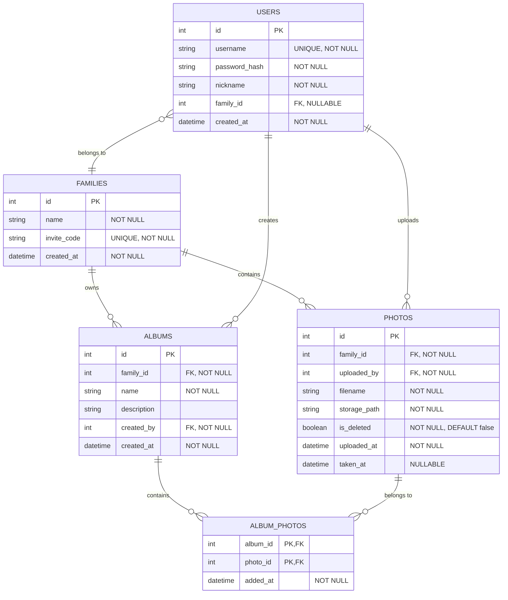

# 实体关系设计文档

本文档定义了「家庭照片管理系统」的数据库实体关系设计。

**作者**: 汪玮芸
**创建日期**: 2025-06-20
**最后更新**: 2025-07-19
**文档状态**: "活跃"
**文档版本**: "**v0.1终极版**"

## 1. 设计概述

本ERD设计基于**v0.1终极版**，核心原则是极致简化，确保MVP版本的快速实现。
- **核心变更**: 移除了用户与家庭的多对多关系，简化为 **一个用户只能属于一个家庭** 的一对多关系，从而大幅降低了数据模型的复杂度。

## 2. 最终实体关系图 (ERD) - v0.1

## 3. 实体描述

### 3.1. USERS（用户表）

存储系统用户的基本信息。

| 字段名 | 类型 | 约束 | 描述 |
|-------|------|------|------|
| id | INTEGER | PK, AUTOINCREMENT | 用户唯一标识 |
| username | TEXT | UNIQUE, NOT NULL | 用户名，作为登录凭证 |
| password_hash | TEXT | NOT NULL | 密码哈希值 |
| nickname | TEXT | NOT NULL | 用户昵称 |
| **family_id** | INTEGER | **FK, NULL** | **所属家庭ID。NULL表示未加入任何家庭。** |
| created_at | TEXT | NOT NULL | 用户创建时间 |

### 3.2. FAMILIES（家庭表）

存储家庭空间的基本信息。

| 字段名 | 类型 | 约束 | 描述 |
|-------|------|------|------|
| id | INTEGER | PK, AUTOINCREMENT | 家庭唯一标识 |
| name | TEXT | NOT NULL | 家庭名称 |
| invite_code | TEXT | UNIQUE, NOT NULL | 邀请码 |
| created_at | TEXT | NOT NULL | 创建时间 |

### 3.3. PHOTOS（照片表）

存储照片元数据信息。为简化模型，移除了`original_filename`, `thumbnail_path`, `file_size`, `description`等次要字段。

| 字段名 | 类型 | 约束 | 描述 |
|-------|------|------|------|
| id | INTEGER | PK, AUTOINCREMENT | 照片唯一标识 |
| family_id | INTEGER | FK, NOT NULL | 所属家庭ID |
| uploaded_by | INTEGER | FK, NOT NULL | 上传者ID |
| filename | TEXT | NOT NULL | 系统生成的文件名 |
| storage_path | TEXT | NOT NULL | 存储路径 |
| is_deleted | BOOLEAN | NOT NULL, DEFAULT 0 | 软删除标记 (0=false, 1=true) |
| uploaded_at | TEXT | NOT NULL | 上传时间 |
| taken_at | TEXT | NULL | 拍摄时间 (从EXIF提取) |

### 3.4. ALBUMS（相册表）

存储相册信息。为简化模型，移除了`cover_photo_id`。

| 字段名 | 类型 | 约束 | 描述 |
|-------|------|------|------|
| id | INTEGER | PK, AUTOINCREMENT | 相册唯一标识 |
| family_id | INTEGER | FK, NOT NULL | 所属家庭ID |
| name | TEXT | NOT NULL | 相册名称 |
| description | TEXT | NULL | 相册描述 |
| created_by | INTEGER | FK, NOT NULL | 创建者ID |
| created_at | TEXT | NOT NULL | 创建时间 |

### 3.5. ALBUM_PHOTOS（相册-照片关系表）

存储相册与照片的多对多关系。

| 字段名 | 类型 | 约束 | 描述 |
|-------|------|------|------|
| album_id | INTEGER | PK, FK | 相册ID |
| photo_id | INTEGER | PK, FK | 照片ID |
| added_at | TEXT | NOT NULL | 添加时间 |