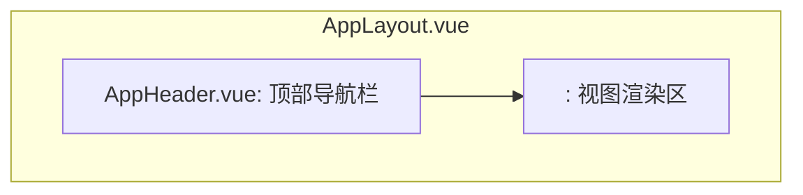

# UI设计规范

本文档定义了「家庭照片管理系统」基于 **Vue.js** 和 **Element Plus** 的UI设计规范。

**作者**: 汪玮芸
**创建日期**: 2025-06-20
**最后更新**: 2025-07-19
**文档状态**: "活跃"
**文档版本**: "**v0.1终极版**"

---

## 1. 设计原则

-   **组件化 (Component-Based)**: UI由可复用、独立的Vue组件构成，提高开发效率和可维护性。
-   **一致性 (Consistency)**: 借助 **Element Plus** 组件库，确保按钮、表单、提示等基础元素的视觉和行为在整个应用中保持一致。
-   **响应式 (Responsive)**: 布局应能适应不同尺寸的屏幕，从桌面到移动设备。
-   **清晰直观 (Clarity & Intuitiveness)**: 界面应易于理解和操作，减少用户的认知负荷。

## 2. 核心技术栈

-   **核心框架**: `Vue.js 3` (使用组合式 API 和 `<script setup>`)
-   **UI组件库**: `Element Plus`
-   **图标**: `Element Plus Icons`

所有UI开发都应优先使用 `Element Plus` 提供的组件。只有在 `Element Plus` 无法满足特定需求时，才考虑自行创建自定义组件。

---

## 3. 页面与核心组件 (Views & Components)

本项目是一个 **单页应用 (SPA)**，所有页面切换均由 `Vue Router` 在前端完成，无需刷新浏览器。

### 3.1. 布局 (Layout)

应用将包含一个主要的布局组件 `AppLayout.vue`，它定义了通用的页面结构。

-   **`AppHeader.vue`**: 包含Logo、导航链接（主页、相册等）以及用户信息/登录注册按钮。
-   **`<router-view>`**: 动态渲染与当前路由匹配的视图组件。

### 3.2. 认证视图 (Auth Views)

#### 3.2.1. 登录视图 (`LoginView.vue`)
-   **路由**: `/login`
-   **核心组件**:
    -   `el-form` 和 `el-form-item`: 构建登录表单。
    -   `el-input`: 用于输入用户名和密码 (`show-password` 属性)。
    -   `el-button`: "登录"和"切换到注册"的按钮。
    -   `el-alert`: 用于显示登录失败的错误提示。
-   **交互**:
    1.  用户填写表单，点击登录。
    2.  调用 `authService.login()` 发送API请求。
    3.  登录成功后，使用 `ElNotification` 给出全局成功提示，并跳转到主页。
    4.  登录失败，在表单上方的 `el-alert` 中显示错误信息。

#### 3.2.2. 注册视图 (`RegisterView.vue`)
-   **路由**: `/register`
-   **核心组件**: 与登录视图类似，使用 `el-form` 构建注册表单。

### 3.3. 主视图 (`HomeView.vue`)

-   **路由**: `/`
-   **描述**: 展示照片瀑布流或网格。
-   **核心组件**:
    -   **`PhotoGrid.vue`** (自定义组件):
        -   内部使用 `el-card` 或自定义卡片来渲染 **`PhotoCard.vue`**。
        -   集成 `el-image` 以支持懒加载 (`lazy`) 和大图预览 (`preview-src-list`)。
        -   集成 `el-skeleton` 在数据加载时显示骨架屏，提升用户体验。
    -   **`UploadButton.vue`** (自定义组件):
        -   使用 `el-button` 并设置为 `position: fixed`，作为悬浮上传按钮。
        -   点击后弹出 **`UploadDialog.vue`**。
    -   `el-pagination`: 用于照片列表的分页。

### 3.4. 照片上传 (Dialog)

-   **组件**: `UploadDialog.vue` (自定义对话框组件)
-   **触发**: 点击 `UploadButton.vue`。
-   **核心组件**:
    -   `el-dialog`: 作为上传功能的容器。
    -   `el-upload`: **核心上传组件**，提供文件选择、拖拽上传、文件列表显示、进度条和状态反馈。
        -   `action`: 设置为后端的 `/api/photos/upload` 地址。
        -   `headers`: **必须动态设置此属性**，以包含JWT认证头，如 `{'Authorization': 'Bearer ' + token}`。
        -   `on-success`, `on-error`: 处理上传成功和失败的回调，并使用 `ElMessage` 给出反馈。
    -   `el-button`: 用于触发上传和关闭对话框。

### 3.5. 相册视图 (Album Views)

#### 3.5.1. 相册列表 (`AlbumListView.vue`)
-   **路由**: `/albums`
-   **描述**: 显示用户所属家庭的相册列表。
-   **核心组件**:
    -   `el-row`, `el-col`: 用于网格布局。
    -   `el-card`: 展示单个相册，包含封面图、名称、照片数量。
    -   `el-button`: 用于创建新相册 (`CreateAlbumDialog.vue`)。
-   **交互**:
    1.  点击相册卡片进入相册详情。
    2.  点击创建按钮弹出创建相册对话框。

#### 3.5.2. 创建/编辑相册 (Dialog)
-   **组件**: `CreateAlbumDialog.vue` / `EditAlbumDialog.vue`
-   **触发**: 点击"创建相册"按钮或相册编辑按钮。
-   **核心组件**:
    -   `el-dialog`
    -   `el-form`, `el-input`: 输入相册名称和描述。
    -   `el-button`: 提交和取消。

#### 3.5.3. 相册详情 (`AlbumDetailView.vue`)
-   **路由**: `/albums/:id`
-   **描述**: 显示特定相册中的所有照片。
-   **核心组件**:
    -   `PhotoGrid.vue`: 复用主页的照片网格组件。
    -   `el-button`: 用于向相册中添加/移除照片，或删除相册。
-   **交互**:
    1.  显示相册名称和描述。
    2.  照片列表支持分页。
    3.  添加照片时，弹出照片选择器 (复用现有照片列表组件，多选)。

### 3.6. 搜索视图 (Search Views)

#### 3.6.1. 搜索页面 (`SearchView.vue`)
-   **路由**: `/search`
-   **描述**: 提供照片搜索功能，并展示搜索结果。
-   **核心组件**:
    -   `el-form`, `el-form-item`: 构建搜索表单。
    -   `el-date-picker`: 用于选择日期范围。
    -   `el-select`: 用于选择上传者。
    -   `el-input`: 用于输入关键词。
    -   `el-button`: 搜索按钮。
    -   `PhotoGrid.vue`: 复用照片网格组件展示搜索结果。
    -   `el-pagination`: 搜索结果的分页。
-   **交互**:
    1.  用户输入或选择搜索条件。
    2.  点击搜索按钮，调用 `searchService.searchPhotos()`。
    3.  搜索结果在 `PhotoGrid.vue` 中显示。

---

## 4. 通用规范

### 4.1. 颜色与字体

-   遵循 `Element Plus` 的默认颜色体系和字体规范，以保持一致性。非必要不覆盖其样式。

### 4.2. 表单

-   所有表单都应使用 `el-form` 组件，并配合 `rules` 属性进行前端数据验证。

### 4.3. 反馈

-   **操作成功**: 使用 `ElMessage` 或 `ElNotification` 提供简短的成功反馈。
    -   `ElMessage.success('登录成功！')`
-   **操作失败**: 使用 `ElMessage.error('密码错误')` 或在表单中使用 `el-alert` 显示错误。
-   **确认操作**: 对于删除等破坏性操作，必须使用 `ElMessageBox.confirm` 弹出确认对话框。
    -   `ElMessageBox.confirm('确定要删除这张照片吗？', '警告', { type: 'warning' })`

### 4.4. 加载状态

-   **页面级加载**: 在路由切换或页面首次加载数据时，显示全局加载指示器（如 `NProgress`）。
-   **组件级加载**: 在组件内部（如卡片、表格）获取数据时，使用 `v-loading` 指令或 `el-skeleton` 组件。

---
最后更新: 2025-07-19 | 版本: v0.1终极版 